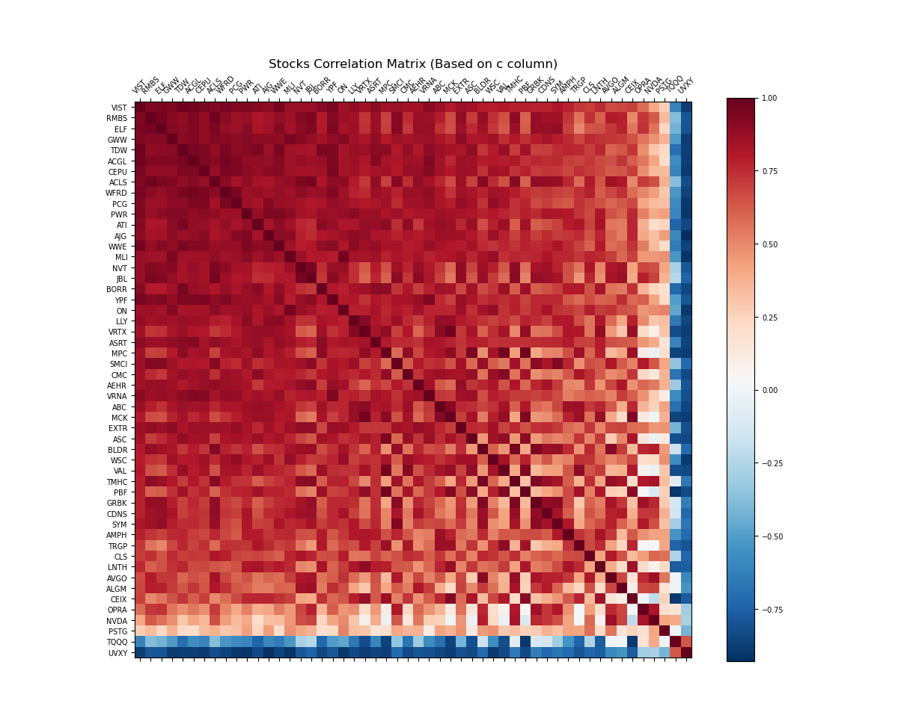
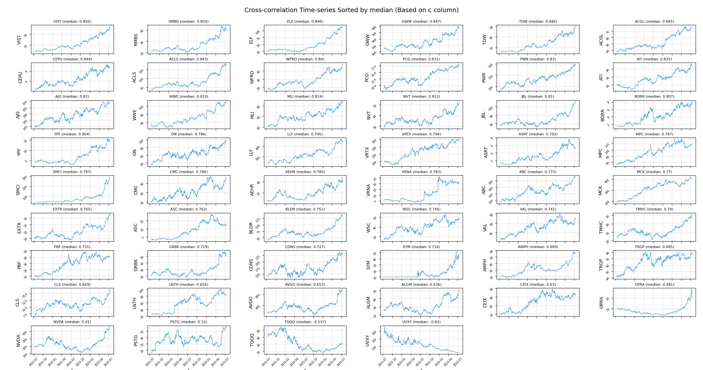

# Alpaca_Cross_Correlation_Analysis
**Alpaca_Cross_Correlation_Analysis** is a Python application that uses the Alpaca API to fetch historical stock data. It allows you to compute correlation matrices based on selected criteria and visualize these correlations with a heatmap and time-series plots. It is a versatile tool for exploring stock market data, particularly useful for financial analysts and traders interested in identifying correlations between different stocks.

## Features
* Fetch historical stock data using the Alpaca API
* Calculate correlation matrices based on user-defined criteria
* Visualize correlation matrices through heatmaps and time-series plots

## Prerequisites
Before you begin, ensure you have met the following requirements:

* Python 3.x
* Install required Python packages with 'pip':

```
pip install -r requirements.txt
```

You will also need to have your own Alpaca API keys to access the stock data. These can be obtained from the Alpaca website.
The Alpaca keys should be exported as environment variables:

```
export APCA_API_KEY_ID=your_key_here
export APCA_API_SECRET_KEY=your_secret_key_here
```

## Usage
Here's a short explanation of how to run the program:

1. Prepare a file that contains a list of stock symbols, one symbol per line.
2. Run the program with your chosen arguments.

Example command (Class and Methods script):

```
python main.class.py -l momentum.lis -n 504 -s median -c c -cm RdBu_r
```
or try the functions script:
```
python main.py -l momentum.lis -n 504 -s median -c c -cm RdBu_r

```




## License
This project is licensed under the terms of the MIT license.

